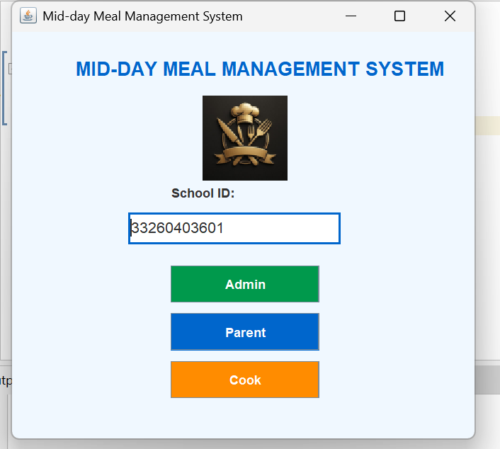
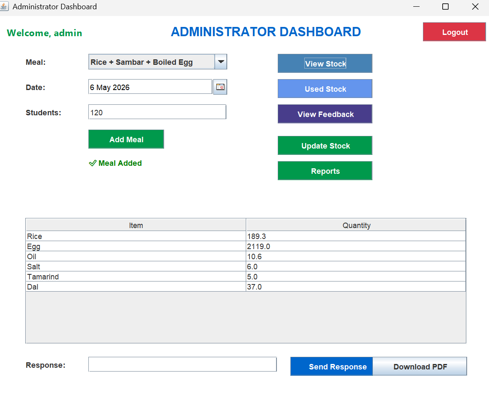
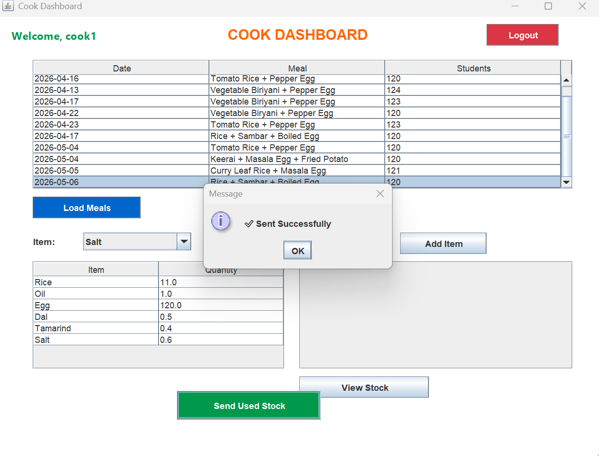
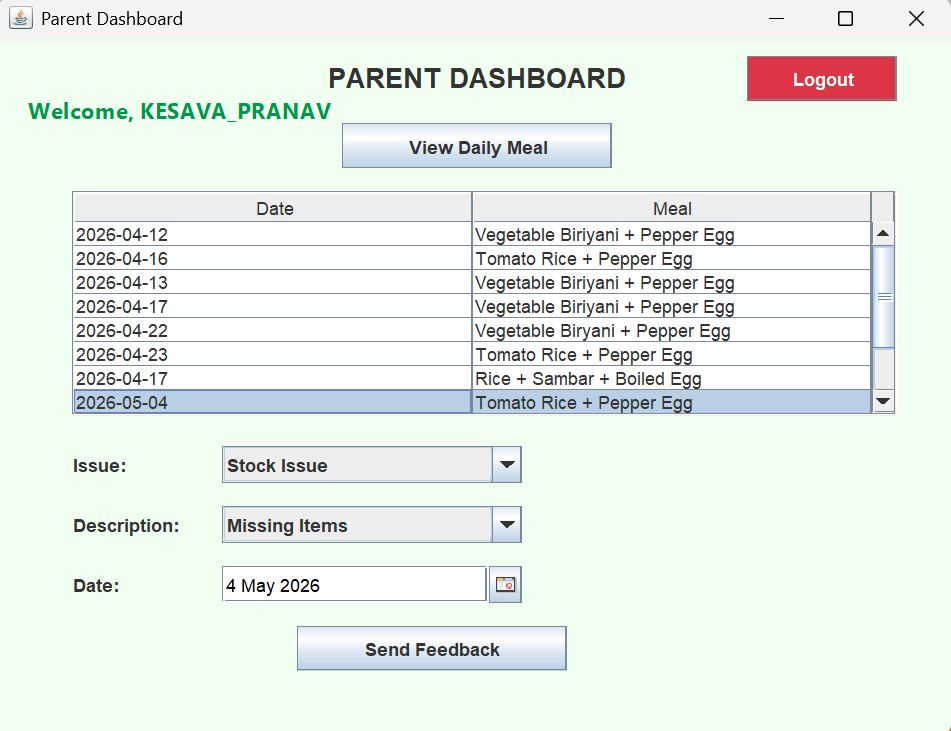
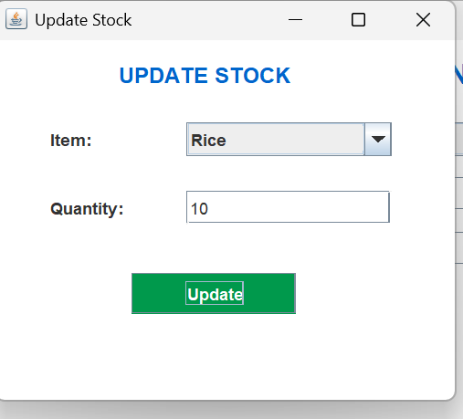
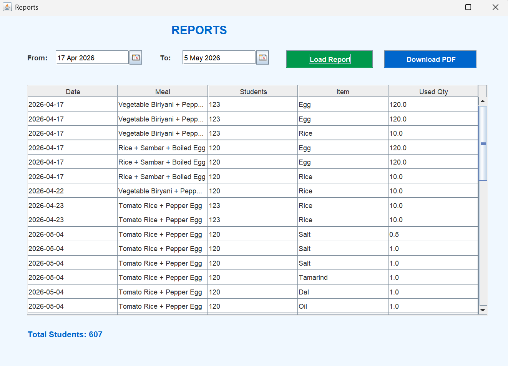

# 🍽️ Smart Midday Meal Management System

A Java Swing and MySQL desktop application developed to simplify and digitize the management of government school midday meals.

---

## 📌 Project Overview

The *Smart Midday Meal Management System* helps schools manage daily meal distribution, stock records, parent feedback, issue tracking, and report generation. It replaces manual record keeping with a simple desktop application.

---

## ✨ Features

- 🔐 Secure Login System
  - Admin Login
  - Cook Login
  - Parent Login

- 🍛 Daily Meal Management

- 📦 Stock Management

- 👨‍👩‍👧 Parent Feedback

- ⚠️ Issue Management

- 📄 PDF Report Generation

- 🗄️ MySQL Database Integration

- 📊 Reports Dashboard

---

## 🛠️ Technologies Used

| Technology | Purpose |
|------------|---------|
| Java | Application Development |
| Java Swing | GUI |
| MySQL | Database |
| JDBC | Database Connectivity |
| Apache NetBeans | IDE |

---

## 📸 Screenshots

### 🏠 Home Page

### 👨‍💼 Admin Dashboard

### 👨‍🍳 Cook Dashboard

### 👨‍👩‍👧 Parent Dashboard

### 📦 Stock Management

### 📄 Report Module

---

## 📂 Project Structure

digitalmidday
│
├── src/
├── nbproject/
├── build.xml
├── manifest.mf
└── README.md

---

## 🚀 How to Run

1. Clone the repository.
2. Open the project in Apache NetBeans.
3. Import the MySQL database.
4. Update database credentials in DBConnection.java.
5. Run the project.

---

## 🎯 Future Enhancements

- SMS Notifications
- Email Alerts
- QR Code Attendance
- Mobile Application
- Cloud Database Support

---

## 👨‍💻 Author

*Gokul M*

Pre-Final Year Information Technology Student

MEPCO Schlenk Engineering College, Sivakasi

---

## ⭐ Support

If you found this project useful, please consider giving it a ⭐ on GitHub.
